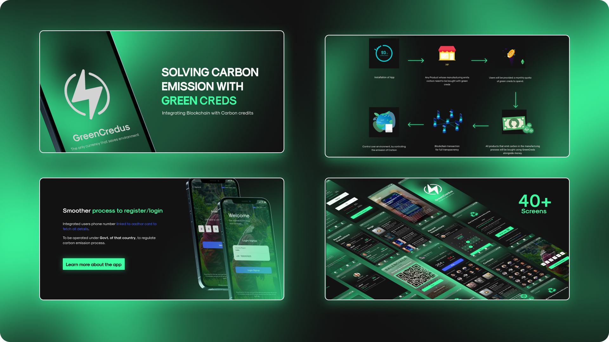
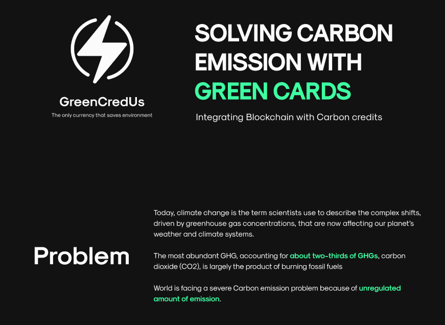
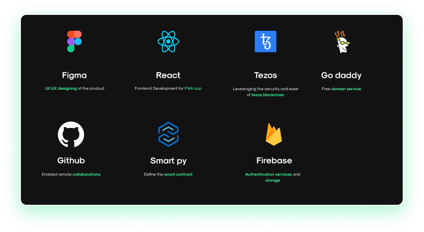

# GreenCredUs

>The only currency that helps to save environment



## Aim



To reduce carbon emission, by integrating blockchain technology to ahieve global standard. The app works in a way that it does not add up to the carbon footprint generation and serves
the goal of users to reduce and take this initiative to reduce carbon emission.

Here are some important links:

- [Our Website](https://www.green-cred.us/)
- [Our Progressive Web App](https://app.green-cred.us/)
- [Deployed Smart Contract](https://delphinet.tezblock.io/account/KT1AQqqKu29eC7hc6Q73unXMwgLCLPdMNo9T)
- [Figma Design File](https://www.figma.com/file/JacqSsKvRUEooB28mYfNwp/KUHACK?node-id=122%3A35)

## Tools Used



- React - Used to make our website and our Progresive App.
- Tezos - Deployed Smart Contract on Tezos Network.
- Figma - Made designs and mood board.
- Smart py - Developed smart contracts for the transactions to take place.
- GoDaddy - Domain Provider.
- Firebase - For two factor OTP authentication and recaptcha.

## Getting Started

### Runnning the PWA App

- Clone the repo.
  `git clone https://github.com/DarthBenro008/greencredus.git`
- Run `npm dapp-install`
- And to inititalise the PWA, run `npm start`

- For running this project successfully you'll need to create a `.env` file and store your firebase credentials there like following in the ./client folder

```env
REACT_APP_FIREBASE_API_KEY=
```

### Deploying the blockchain smart contract

- Download a Faucet Tezos Wallet from [here](https://faucet.tzalpha.net/).
- Using [ConseilJS](https://cryptonomic.github.io/ConseilJS/#/) find the helper scripts in the `utils` folder and generate a keystore
- Edit your Tezos Address in the `config.js` file.
- run the following commands:

  ```bash
  npm run sync
  npm run compile
  npm run deploy
  ```

> Note: The given keystore is deployed on a Tezos Testnet (Delphinet) and is solely used for educational purposes only.

## Contributing

- Clone the repo.
  `git clone https://github.com/DarthBenro008/greencredus.git`
- Checkout to a new branch.
  `git checkout -b my-amazing-feature`
- Make some amazing changes.
- `git add .`
- `git commit -m "A short description about the feature."`
- `git push origin my-amazing-feature`
- Open a pull request :)


## Authors
<!-- ALL-CONTRIBUTORS-LIST:START - Do not remove or modify this section -->
<!-- prettier-ignore-start -->
<!-- markdownlint-disable -->
<table>
	<tr>
		<td align="center">
			<a href="https://github.com/DarthBenro008"><br /><sub><b>Hemanth Krishna</b></sub></a><br /> <a href="https://github.com/IEEE-VIT/recruitments2020-backend/commits?author=DarthBenro008" title="Documentation">📖 <a href="https://github.com/IEEE-VIT/recruitments2020-backend/commits?author=DarthBenro008" title="Code"> 💻 </a><a href="#infra-DarthBenro008" title="Infrastructure (Hosting, Build-Tools, etc)"> 🚇 </a>
		</td>
  <td align="center">
			<a href="https://github.com/r-ush"><br /><sub><b>Aarush Bhat</b></sub></a><br /> <a href="https://github.com/IEEE-VIT/recruitments2020-backend/commits?author=r-ush" title="Documentation">📖 <a href="https://github.com/IEEE-VIT/recruitments2020-backend/commits?author=r-ush" title="Code"> 💻 </a><a href="#infra-r-ush" title="Infrastructure (Hosting, Build-Tools, etc)"> 🚇 </a>
		</td>
  <td align="center">
			<a href="https://github.com/hsrambo07"><br /><sub><b>Harsh Singhal</b></sub></a><br /> <a href="https://github.com/IEEE-VIT/recruitments2020-backend/commits?author=r-ush" title="Documentation">📖 <a href="https://github.com/IEEE-VIT/recruitments2020-backend/commits?author=r-ush" title="Code"> 💻 </a><a href="#infra-r-ush" title="Infrastructure (Hosting, Build-Tools, etc)"> 🚇 </a>
		</td>
	</tr>
</table>

<br />

<p align="center">Made with ❤ to save the environment!</p>
